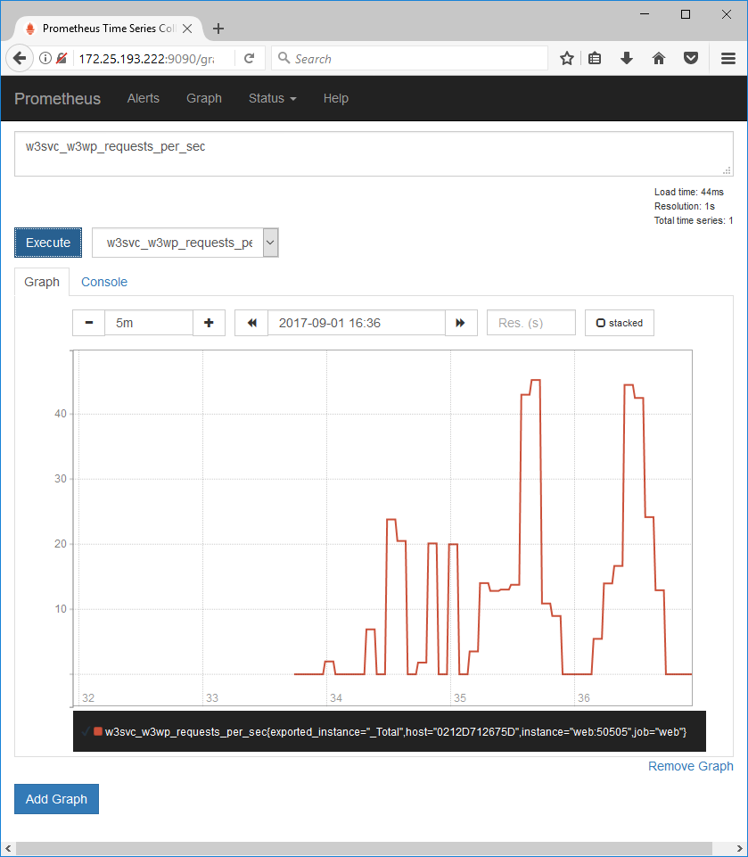

# ASP.NET Monitoring

Monitoring ASP.NET Framework applications in Windows Docker containers, using Prometheus.

This sample app shows you how to export Windows and .NET Performance Counters from a Docker Windows container, run [Prometheus](https://prometheus.io) in a Docker Windows container, and use Prometheus to monitor the ASP.NET web container:



The screenshot shows a graph of the `Requests / Sec` IIS performance counter values, which are exported from the web container and scraped by the Prometheus container.

There are three parts to the sample:

* exporter - a console app which publishes performance counter metrics
* website - a WebForms app which uses the exporter
* prometheus - the Prometheus server which stores metrics

## Exporter

A .NET Framework console app which uses [prometheus-net](https://github.com/andrasm/prometheus-net) to collect performance counter metrics and expose them in a Prometheus-formatted endpoint. The exporter app adds a new set of metrics collectors which can be configured at runtime - e.g. in [w3svc-collectors.json](exporter/src/DockerSamples.AspNetExporter.App/w3svc-collectors.json):

```
{
  "PerformanceCounterCollectors": [
    {
      "CategoryName": ".NET CLR Memory",
      "InstanceName": "_Global_",
      "CounterNames": [
        "Gen 0 heap size",
...
```

The console app is packaged in the `dockersamples/aspnet-monitoring-exporter` Docker image for easy distribution, but it is not meant to be used on its own. It can be packaged into your own .NET application image to export metrics without having to change your app.

## Website

A sample ASP.NET WebForms website which is packaged with the exporter app. In the [Dockerfile](website/Dockerfile) the exporter app is installed from the exporter image:

```
FROM dockersamples/aspnet-monitoring-exporter AS exporter
...
WORKDIR C:\aspnet-exporter
COPY --from=exporter C:\aspnet-exporter .
ENV COLLECTOR_CONFIG_PATH="w3svc-collectors.json"
```

That copies the exporter app binaries into the website image, and sepcifyies the config file to use - this example collects basic .NET and IIS Performance Counters.

In the startup configuration for the image, the exporter app is started in the background:

```
ENTRYPOINT ["powershell"]

CMD Start-Service W3SVC; `
    Invoke-WebRequest http://localhost -UseBasicParsing | Out-Null; `
    Start-Process -NoNewWindow C:\aspnet-exporter\aspnet-exporter.exe; `
    C:\ServiceMonitor.exe w3sv
```

When a container is run from the website image, the metrics are exposed on port `50505`. That port isn't publicly exposed, so only other Docker containers in the same network can access it.

## Prometheus

This packages Prometheus to run in a Docker Windows container, based on the work by [Docker Captain Stefan Scherer](https://twitter.com/stefscherer?lang=en) in [stefanscherer/prometheus-windows](https://hub.docker.com/r/stefanscherer/prometheus-windows/). The [Dockerfile](prometheus/Dockerfile) deploys Prometheus and sets some default configuration values. When you run a container from this image, you can browse to the Prometheus UI on port 9090.

## Usage

Run `docker-compose up -d` from this directory, and that will start the web and Prometheus containers. You can browse to the website container running locally by opening the IP address with PowerShell:

```
$webIp = docker inspect --format '{{ .NetworkSettings.Networks.nat.IPAddress }}' aspnet-monitoring_web_1
start "http://$webIp"
```

Refresh the page a few times and then browse to the Prometheus container:

```
$promIp = docker inspect --format '{{ .NetworkSettings.Networks.nat.IPAddress }}' aspnet-monitoring_prometheus_1
start "http://$($promIp):9090"
```

You'll see the Prometheus UI, with all the metrics listed. These are scraped from the performance counters in the web container.